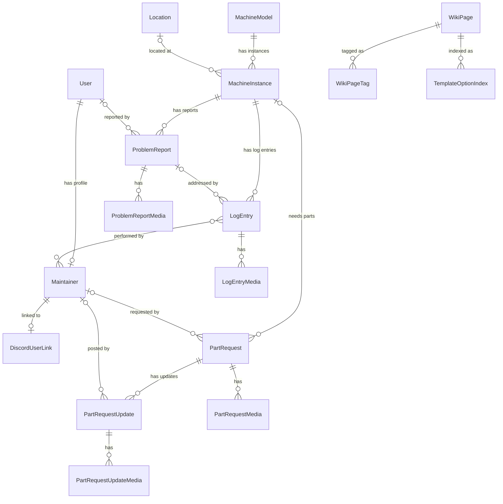

# Data Model

## Entity Relationship Diagram

**Notes:**

- A circle (○) on a relationship line indicates an optional (nullable) foreign key.
- `LogEntry ↔ Maintainer` is a many-to-many relationship.
- `Invitation`, `WikiTagOrder`, `RecordReference`, and `DiscordMessageMapping` are standalone or use polymorphic links (ContentType GFKs) and are not shown above.
- Audit fields (`created_by`, `updated_by`, `created_at`, `updated_at`) are omitted — most models with these have nullable FKs to `User`.
- All media models inherit from `AbstractMedia` and share the same structure (media_type, file, thumbnail, transcode status, etc.).

## Accounts app

### Maintainer ([`Maintainer`](../the_flip/apps/accounts/models.py))

Person who performs work on the pinball machines. Linked to Django User account.

### Invitation ([`Invitation`](../the_flip/apps/accounts/models.py))

Token-based invitation for new maintainers to register.

## Catalog app

### Machine Model ([`MachineModel`](../the_flip/apps/catalog/models.py))

A model of pinball machine (e.g., "Star Trek", "Godzilla").

### Machine Instance ([`MachineInstance`](../the_flip/apps/catalog/models.py))

A specific physical machine in the museum (e.g., "Star Trek #2").

### Location ([`Location`](../the_flip/apps/catalog/models.py))

Physical location where machines can be placed (e.g., "Main Floor", "Workshop").

## Maintenance app

### Problem Report ([`ProblemReport`](../the_flip/apps/maintenance/models.py))

Issue reported by museum visitor.

### Log Entry ([`LogEntry`](../the_flip/apps/maintenance/models.py))

Journal-type entry created by maintainers to document work on a machine.

### Problem Report Media ([`ProblemReportMedia`](../the_flip/apps/maintenance/models.py))

Photos/videos attached to problem reports.

### Log Entry Media ([`LogEntryMedia`](../the_flip/apps/maintenance/models.py))

Photos/videos attached to log entries.

## Parts app

### Part Request ([`PartRequest`](../the_flip/apps/parts/models.py))

Request for a part needed for maintenance. Tracks status through requested → ordered → received lifecycle. Can optionally be linked to a specific machine.

### Part Request Media ([`PartRequestMedia`](../the_flip/apps/parts/models.py))

Photos/videos attached to part requests.

### Part Request Update ([`PartRequestUpdate`](../the_flip/apps/parts/models.py))

Comment or status update on a part request. Can optionally change the part request's status.

### Part Request Update Media ([`PartRequestUpdateMedia`](../the_flip/apps/parts/models.py))

Photos/videos attached to part request updates.

## Wiki app

### Wiki Page ([`WikiPage`](../the_flip/apps/wiki/models.py))

A wiki page with markdown content. Pages are identified by slug derived from title.

### Wiki Page Tag ([`WikiPageTag`](../the_flip/apps/wiki/models.py))

Places a wiki page in the navigation tree. A page can have multiple tags, appearing in multiple locations. The empty string tag is a sentinel for untagged pages.

### Wiki Tag Order ([`WikiTagOrder`](../the_flip/apps/wiki/models.py))

Optional explicit ordering for tags in navigation. Tags without entries sort alphabetically.

### Template Option Index ([`TemplateOptionIndex`](../the_flip/apps/wiki/models.py))

Auto-maintained index of wiki template options for create-form dropdowns. Rebuilt on every wiki page save from `template:action` markers in page content.

## Core app

### Record Reference ([`RecordReference`](../the_flip/apps/core/models.py))

Tracks cross-record links (e.g., `[[machine:slug]]`) between any two records for "what links here" queries. Uses Django's contenttypes framework for polymorphic source/target.

## Discord app

### Discord User Link ([`DiscordUserLink`](../the_flip/apps/discord/models.py))

Links a Discord user to a Maintainer account for attribution.

### Discord Message Mapping ([`DiscordMessageMapping`](../the_flip/apps/discord/models.py))

Tracks which Discord messages have been processed and links them to the records they created. This prevents an echo of posting the new records back to Discord, as well as prevents users from attempting to post a Discord message to Flipfix multiple times.
